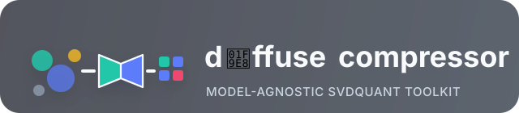

<p align="center">
  
</p>

`diffuse_compressor` is a model-agnostic SVDQuant toolkit for diffusion
transformers. It prepares user-selected projection targets, runs calibration
replay, quantizes diffusion backbones to INT4 or NVFP4-style weights, and
exports Nunchaku-compatible safetensors checkpoints.

The core package deliberately avoids hard-coding Flux, PixArt, Sana, ERNIE,
LongCat, video, or image-edit architecture details. Those choices live in
`TargetConfig` examples and downstream user configuration, so the library stays
small enough to adapt to new diffusion models.

## Highlights

- Model-agnostic target collection with wildcard paths, class scans, grouped
  QKV/KV projections, skips, and target-level overrides.
- Generic model rewrites such as splitting fused linear or convolution
  projections before target collection.
- SVDQuant for linear projections and pointwise Conv2d projections.
- INT4 and FP4/NVFP4-style residual weight export paths, including
  DeepCompressor-style scale dtype metadata.
- Disk-backed calibration replay with scoped activation capture, cache reuse,
  artifact caching, and memory-sensitive replay.
- Nunchaku Lite and Nunchaku-style safetensors export with adjacent config
  metadata and optional runtime manifests.
- Runnable Diffusers examples for text-to-image, image-to-image, and
  text-to-video configuration sketches.

## Installation

Install the package in editable mode:

```bash
python -m pip install -e .
```

Install development tools:

```bash
python -m pip install -e ".[dev]"
```

Install example data-loading extras for examples that download calibration
images from Hugging Face datasets:

```bash
python -m pip install -e ".[examples]"
```

Nunchaku Lite runtime patching still requires installing `nunchaku_lite` from
its release or private package channel. The `nunchaku-lite` extra is only an
explicit optional-runtime marker; it does not install a public PyPI package.

## Guidelines

- [Text-to-image end-to-end guide](docs/text_to_image_end_to_end_guide.md):
  quantize, evaluate, and run inference with FLUX.2 Klein 4B.
- [Image-to-image end-to-end guide](docs/image_to_image_end_to_end_guide.md):
  quantize, evaluate, and run inference with LongCat Image Edit.
- [Adding a new model](docs/adding_new_model.md): adapt target configs,
  patches, calibration scopes, inspection, quantization, evaluation, and
  inference for another architecture.

## Example CLIs

Run one of the Diffusers-backed examples:

```bash
python examples/text_to_image/quantize_flux1_schnell.py --precision int4
python examples/text_to_image/quantize_flux1_schnell.py --precision nvfp4
```

Override defaults for a larger run:

```bash
python examples/text_to_image/quantize_flux2_klein_4b.py \
  --precision int4 \
  --model-id black-forest-labs/FLUX.2-klein-4B \
  --num-samples 128 \
  --batch-size 1 \
  --output outputs/checkpoints/svdq-int4_r32-flux2-klein-4b.safetensors
```

Use a lower-memory preset when VRAM or calibration RAM is tight:

```bash
python examples/text_to_image/quantize_flux2_klein_4b.py \
  --precision int4 \
  --num-samples 64 \
  --cache-num-samples 64 \
  --batch-size 1 \
  --sample-batch-size 32 \
  --scope-capture-mode one-target \
  --pipeline-offload sequential \
  --offload-model \
  --compute-device cuda
```

For GPU VRAM, the main knobs are `--batch-size 1`, `--pipeline-offload model`
or `sequential`, `--offload-model`, and `--compute-device cuda`. The
`--cache-num-samples`, `--sample-batch-size`, and
`--scope-capture-mode one-target` options primarily reduce calibration memory
and replay working set. See
[docs/low_memory_quantization.md](docs/low_memory_quantization.md) for the full
tradeoffs.

Supported example families:

| Task | Examples |
| --- | --- |
| Text-to-image | FLUX.1 Schnell, FLUX.1 Dev, FLUX.2 Klein 4B/9B, PixArt Sigma, Sana 1.6B, ERNIE-Image, ERNIE-Image Turbo |
| Image-to-image | LongCat Image Edit Turbo |
| Text-to-video | Target configuration sketch |

The full example table, command matrix, output paths, defaults, and offload
notes are preserved in [docs/examples.md](docs/examples.md).

## Configuration

A target config answers which model modules become quantized runtime
projections. It can describe:

- structural patches to expose targetable child modules;
- single-module and grouped projection targets;
- pointwise Conv2d projector targets;
- skipped modules and unquantized state-dict patterns;
- calibration scopes that replay and clear activations by block;
- runtime-specific tensor layouts such as Nunchaku SVDQ, AWQ W4A16, and
  AdaNorm AWQ W4A16.

Inspect a config before running a full quantization job:

```python
from diffuse_compressor import inspect_target_config

report = inspect_target_config(model, target_config)
print(report.format_text())
assert report.ok
```

Example scripts also support:

```bash
python examples/text_to_image/quantize_flux1_schnell.py --inspect-config
```

See [docs/configuration.md](docs/configuration.md) for target rules, skips,
calibration scopes, inspection output, and small runnable recipes.

## Checkpoint Export

The Nunchaku exporter writes one safetensors file containing:

- quantized target parameters under configured `export_name` prefixes;
- untouched non-target model parameters required for strict runtime loading;
- compact `quantization_config.*` compatibility metadata;
- optional `quantization_config.runtime_manifest` metadata when the checkpoint
  can declare a generic Nunchaku Lite runtime ABI.

Config metadata is written beside the checkpoint as
`<checkpoint-stem>.config.yaml`. The schema is documented in
[docs/checkpoint_metadata.md](docs/checkpoint_metadata.md), and the Nunchaku
Lite runtime manifest is documented in
[docs/nunchaku_lite_manifest_v1.md](docs/nunchaku_lite_manifest_v1.md).

For Nunchaku-style SVDQuant, quantized linear targets use keys such as:

```text
transformer_blocks.0.attn.to_qkv.qweight
transformer_blocks.0.attn.to_qkv.wscales
transformer_blocks.0.attn.to_qkv.smooth_factor
transformer_blocks.0.attn.to_qkv.smooth_factor_orig
transformer_blocks.0.attn.to_qkv.proj_down
transformer_blocks.0.attn.to_qkv.proj_up
```

## Documentation

| Document | Contents |
| --- | --- |
| [docs/usage.md](docs/usage.md) | Basic API usage, calibration-aware SVD, cache modes, artifact cache behavior |
| [docs/adding_new_model.md](docs/adding_new_model.md) | Guide for adapting target configs, patches, scopes, inspection, and validation to a new model architecture |
| [docs/text_to_image_end_to_end_guide.md](docs/text_to_image_end_to_end_guide.md) | Text-to-image quantization, evaluation, and inference guide |
| [docs/image_to_image_end_to_end_guide.md](docs/image_to_image_end_to_end_guide.md) | Image-to-image quantization, evaluation, and inference guide |
| [docs/examples.md](docs/examples.md) | Full upstream example table, command matrix, output paths, and example notes |
| [docs/configuration.md](docs/configuration.md) | Target rules, skips, overrides, calibration scopes, inspection recipes |
| [docs/deepcompressor_mapping.md](docs/deepcompressor_mapping.md) | DeepCompressor SVDQuant setting equivalents |
| [docs/original_flow.md](docs/original_flow.md) | Original DeepCompressor diffusion SVDQuant flow and implementation references |
| [docs/nunchaku_weight_packing.md](docs/nunchaku_weight_packing.md) | Nunchaku W4A4 packing, NVFP4 scale keys, and DeepCompressor conversion parity |
| [docs/evaluation.md](docs/evaluation.md) | Runtime helpers, torch-dequant, Nunchaku Lite, and benchmark commands |
| [docs/low_memory_quantization.md](docs/low_memory_quantization.md) | CPU RAM and GPU VRAM controls for large examples |
| [docs/checkpoint_metadata.md](docs/checkpoint_metadata.md) | Adjacent checkpoint config schema |
| [docs/nunchaku_lite_manifest_v1.md](docs/nunchaku_lite_manifest_v1.md) | Nunchaku Lite runtime manifest schema |
| [docs/development.md](docs/development.md) | Core flow, extension points, and testing notes |
| [docs/backlog.md](docs/backlog.md) | Open backlog items |

## Development

Install in editable mode with test/build tools:

```bash
python -m pip install -e ".[dev]"
```

Run the test suite:

```bash
pytest
```

Run a focused test while iterating on quantization or export behavior:

```bash
pytest tests/test_quantize_export.py
```

Build source and wheel distributions:

```bash
python -m build
```

## Project Boundaries

The intended extension points are new quantization methods under
`src/diffuse_compressor/methods/`, generic architecture-independent patches in
`patches.py`, and exporters under `src/diffuse_compressor/exporters/`.
Model-specific target patterns, grouped projections, calibration details, and
runtime-specific rewrites should stay in `examples/` or downstream configs.

## Security

Do not commit downloaded model weights, calibration caches, generated
safetensors, local benchmark outputs, or secrets. Keep Hugging Face tokens and
other credentials in your environment or local tooling.

## Acknowledgements

This project builds on ideas and compatibility targets from
[DeepCompressor](https://github.com/nunchaku-ai/deepcompressor), the original
Nunchaku SVDQuant diffusion compression repository.

## License

See [LICENSE](LICENSE).
