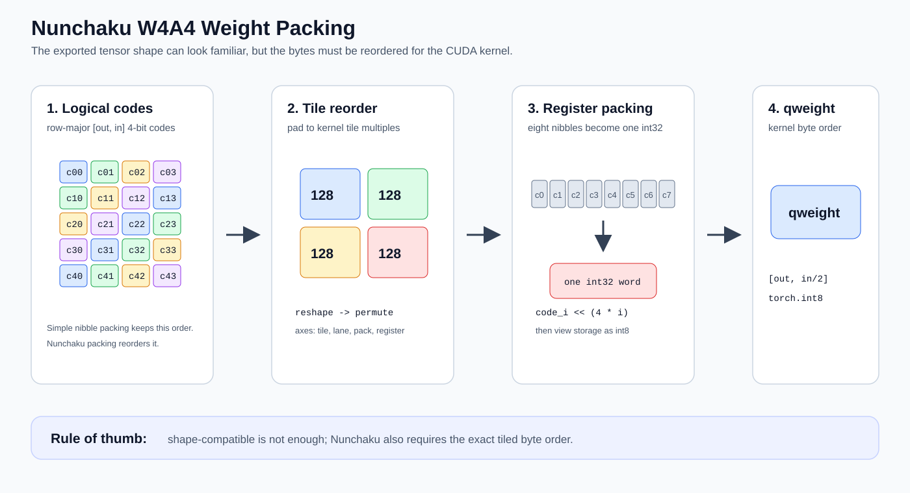
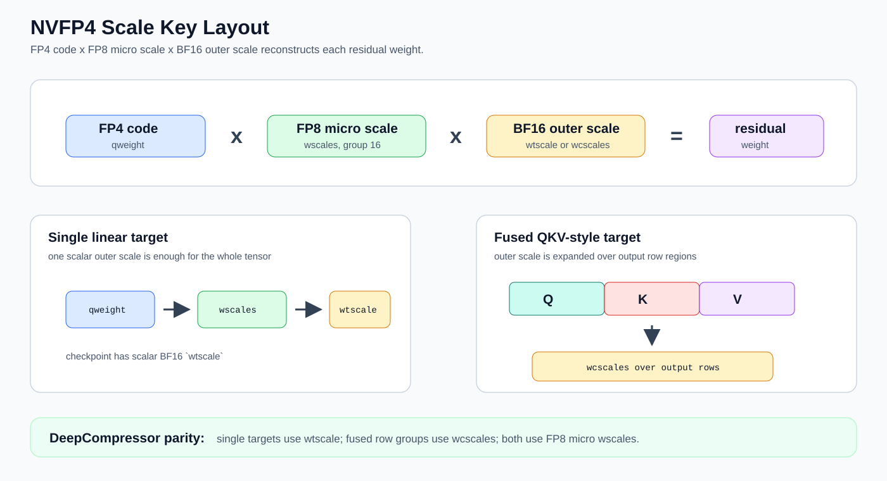

# Nunchaku Weight Packing

This note explains how Nunchaku W4A4 checkpoint tensors are packed, using the
original DeepCompressor implementation as the reference. It is intended for
newcomers who already know what a linear layer is, but do not yet know why a
Nunchaku checkpoint cannot store tensors in ordinary row-major order.

## Reference Code

Original DeepCompressor implementation:

- [deepcompressor/backend/nunchaku/convert.py](https://github.com/nunchaku-ai/deepcompressor/blob/main/deepcompressor/backend/nunchaku/convert.py)
  - `convert_to_nunchaku_w4x4y16_linear_state_dict(...)`
  - chooses checkpoint key names such as `qweight`, `wscales`, `wcscales`,
    `wtscale`, `smooth`, `smooth_orig`, `lora_down`, and `lora_up`
  - applies the smooth/shift correction to LoRA before packing
- [deepcompressor/backend/nunchaku/utils.py](https://github.com/nunchaku-ai/deepcompressor/blob/main/deepcompressor/backend/nunchaku/utils.py)
  - `convert_to_nunchaku_w4x4y16_linear_weight(...)`
  - quantizes the residual weight and calls `NunchakuWeightPacker`

Diffuse Compressor mirror:

- `src/diffuse_compressor/backends/nunchaku/packing.py`
  - `NunchakuWeightPacker`
- `src/diffuse_compressor/backends/nunchaku/layouts.py`
  - `pack_nunchaku_w4a4_state(...)`
  - `nvfp4_scale_leaves(...)`

## Compatibility Summary

Nunchaku checkpoints can pass strict state-dict shape checks while still
producing invalid outputs if exporter semantics do not match the runtime kernel
layout. Compatibility depends on a set of DeepCompressor/Nunchaku conversion
rules that must all match at export time.

The exporter must:

- export aligned SVDQ targets in true Nunchaku-packed layout, not logical
  row-major nibble layout.
- record the runtime tensor layout in metadata as `nunchaku_packed` or
  `logical`, so incompatible torch-dequant paths can reject packed tensors.
- split NVFP4 scales into DeepCompressor-style outer scales plus FP8 micro
  scales:
  - fused targets such as QKV write FP8 `wscales` plus BF16 `wcscales`.
  - single targets write FP8 `wscales` plus scalar BF16 `wtscale`.
- pack `qweight`, `wscales`, `wcscales`, `smooth`, `bias`, `lora_down`, and
  `lora_up` with `NunchakuWeightPacker`, matching DeepCompressor tile order.
- unsmooth `lora_down` before low-rank packing.
- implement DeepCompressor's shifted low-rank bias correction for explicit
  shifted packed exports:

  ```text
  lora_down = lora_down / smooth
  bias += lora_up @ lora_down @ shift
  ```

- preserve the activation-shift setting from the reference configuration being
  matched. Shifted packed checkpoints can be exported for experiments, but the
  runtime and checkpoint must agree on whether shifts are active.
- when regenerating after these changes, refresh or delete the artifact cache;
  otherwise a stale shifted packed artifact can be reused.

## Why Packing Exists

A logical 4-bit tensor is easy to understand:

```text
logical qweight: [out_features, in_features / 2]

each byte contains two 4-bit codes:
  low nibble  = code for input column 2i
  high nibble = code for input column 2i + 1
```

That layout is useful for Python dequantization, but it is not the memory
layout expected by Nunchaku CUDA kernels. Nunchaku kernels read weights in MMA
tiles, with output channels, input channels, lanes, packs, and register groups
interleaved.

So a Nunchaku checkpoint must store:

```text
logical values -> quantized 4-bit codes -> padded tiled layout -> packed bytes
```

The final tensor may still have a familiar shape like:

```text
[out_features, in_features / 2]
```

but the bytes are not row-major nibble order. They are ordered for the kernel.
If a logical checkpoint is loaded as if it were Nunchaku-packed, the state dict
can pass shape checks while the generated image becomes noise.



## DeepCompressor Conversion Flow

DeepCompressor has two layers of conversion.

The state-dict converter decides names and preprocessing:

```python
convert_to_nunchaku_w4x4y16_linear_state_dict(
    weight,
    scale,
    bias,
    smooth,
    lora,
    shift,
    smooth_fused,
    float_point,
    subscale,
)
```

Important behavior:

- `scale.numel() == 1` becomes checkpoint key `wtscale`.
- multi-value scale with one group becomes `wcscales`.
- multi-value scale with many groups becomes `wscales`.
- NVFP4 `subscale` becomes the FP8 micro `wscales`.
- when LoRA and smoothing are both present, `lora_down` is divided by the
  smooth vector before packing.
- if a shift is present, the shift contribution is folded into bias.

Then the tensor converter quantizes and packs:

```python
convert_to_nunchaku_w4x4y16_linear_weight(
    weight,
    scale,
    bias,
    smooth,
    lora,
    float_point,
    subscale,
)
```

Its high-level order is:

```text
1. reshape scale to [out, 1, groups, 1]
2. divide weight by outer scale
3. divide by subscale when NVFP4 micro scales are present
4. quantize:
   - FP4 path: nearest FP4 E2M1 code in [0, 15]
   - INT4 path: round and clamp to [-8, 7]
5. materialize missing bias as zeros
6. materialize missing smooth as ones
7. pad weight, scale, subscale, bias, smooth
8. pack weight, scale, subscale, bias, smooth
9. pack low-rank LoRA tensors
10. collapse packed per-tensor scale back to scalar `wtscale`
```

## Weight Packing

Nunchaku starts from quantized codes in logical matrix layout:

```text
qweight codes: [out_features, in_features]
dtype: int32
FP4 codes: 0..15
INT4 codes: -8..7, later masked to 4 bits
```

The packer pads the matrix to kernel tile multiples:

```text
out_features padded to multiple of warp_n, usually 128
in_features padded to multiple of mem_k * num_k_unrolls
```

For 4-bit Nunchaku W4A4, the default geometry is:

```text
warp_n = 128
comp_k = 64
num_k_unrolls = 2
required input multiple = 128
```

Then `pack_weight` reshapes one 2D matrix into many tile dimensions:

```text
[N, K]
-> [
     N / mem_n,
     n packs,
     n pack size,
     n lanes,
     n registers,
     K / mem_k,
     k packs,
     k pack size,
     k lanes,
     k registers
   ]
```

It then permutes those dimensions into the order the CUDA kernel consumes.
Finally, eight 4-bit values are combined into one `int32`:

```text
code0 << 0
code1 << 4
code2 << 8
...
code7 << 28
```

That `int32` storage is viewed as `int8`, producing the final checkpoint
`qweight`.

The important point is that simple nibble packing and Nunchaku packing are not
equivalent:

```text
simple packing:
  preserve row-major code order

Nunchaku packing:
  reorder codes into kernel tile order, then pack nibbles
```

## Scale Packing

Nunchaku also packs scale-like tensors. This includes:

- `wscales`
- `wcscales`
- expanded `wtscale` before it is collapsed back to one scalar
- `bias`
- `smooth`

The regular scale path uses `pack_scale(scale, group_size=...)`.

For vector-like tensors such as bias and smooth, DeepCompressor calls the same
packing path with `group_size=-1`:

```text
bias   logical: [out_features]
smooth logical: [in_features]
```

They are reshaped to column vectors, padded to the output tile multiple, and
then reordered to the kernel's scale layout.

## NVFP4 Micro Scales

NVFP4 has two scale levels:

```text
actual weight scale = outer scale * FP8 micro scale
```

The checkpoint stores:

```text
qweight  : packed FP4 E2M1 codes
wscales  : FP8 E4M3 micro scales for group size 16
wcscales : optional BF16 per-output-channel outer scale
wtscale  : optional BF16 scalar outer scale
```

DeepCompressor uses `subscale` for the FP8 micro scale before writing it as
`wscales`.

For NVFP4 group size 16, `pack_scale` switches to `pack_micro_scale`. That path:

```text
1. converts micro scales to torch.float8_e4m3fn
2. reshapes by Nunchaku tile geometry
3. permutes into kernel micro-scale order
4. returns shape [num_scale_groups, out_features]
```

This is why NVFP4 `wscales` are FP8, not BF16.



## wtscale vs wcscales

DeepCompressor chooses the outer-scale key based on the outer scale shape:

```text
scale.numel() == 1
  -> wtscale

scale has one value per output channel
  -> wcscales

scale has many groups
  -> wscales
```

For NVFP4 SVDQ this usually means:

```text
single linear target:
  qweight + FP8 wscales + scalar BF16 wtscale

fused target such as QKV:
  qweight + FP8 wscales + BF16 wcscales
```

For fused targets, DeepCompressor may expand one scalar per fused source tensor
into the corresponding output-channel range. For example, Q, K, and V each get
their own outer scale region after concatenation.

## Low-Rank Packing

SVDQuant stores a low-rank correction:

```text
effective weight = residual quantized weight + lora_up @ lora_down
```

Nunchaku fuses this path in its W4A4 kernels, so low-rank tensors must also be
packed.

DeepCompressor does two important things before packing:

```text
if smooth is active:
  lora_down = lora_down / smooth

if shift is active:
  bias += lora_up @ lora_down @ shift
```

The smooth correction matters because Nunchaku applies activation smoothing in
the runtime activation quantizer. The low-rank branch must therefore be stored
in the unsmoothed input domain.

Then low-rank tensors are packed:

```text
lora_down logical: [rank, in_features]
lora_up   logical: [out_features, rank]

packed lora_down checkpoint shape: [in_features, rank]
packed lora_up checkpoint shape:   [out_features, rank]
```

The shapes may look logical, but the tile order inside them is packed.

## Activation Shifts

DeepCompressor supports an optional pipeline-level activation shift pass:

```yaml
pipeline:
  shift_activations: true | false
```

This matters for Nunchaku Lite checkpoints because a shifted export has folded
bias terms and a populated `activation_shifts` metadata map. That checkpoint can
pass strict state-dict loading but still generate invalid outputs if the runtime
path expects the unshifted format.

Follow the reference configuration for the model and precision being matched.
For example, some upstream NVFP4 diffusion examples are unshifted, while INT4
examples commonly enable activation shifts:

```text
NVFP4 upstream examples:
  shift_activations may be False

INT4 upstream examples:
  shift_activations is commonly True
```

The packed exporter still implements the DeepCompressor shift correction for
explicit shifted experiments, but each model family should keep the same shift
setting as the checkpoint format it is intended to match.

## Mapping to Diffuse Compressor

Diffuse Compressor mirrors this in `pack_nunchaku_w4a4_state(...)`:

```text
1. divide residual weight by scale and optional subscale
2. quantize to FP4 or INT4 codes
3. pack qweight with NunchakuWeightPacker.pack_weight
4. pack outer scale with pack_scale
5. pack NVFP4 micro scale with pack_micro_scale through pack_scale
6. pack smooth and bias with pack_scale(..., group_size=-1)
7. unsmooth proj_down
8. if shift is present, fold lora_up @ unsmoothed_proj_down @ shift into bias
9. pack proj_down and proj_up with pack_lowrank_weight
```

For aligned real model targets, the exporter writes metadata:

```json
"runtime_tensor_layout": "nunchaku_packed"
```

For small toy targets that do not satisfy Nunchaku tile multiples, it keeps the
older logical layout and records:

```json
"runtime_tensor_layout": "logical"
```

## Practical Checklist

A Nunchaku W4A4 checkpoint is likely wrong if:

- `qweight` was only simple nibble-packed.
- `wscales` are row-major logical scales instead of packed scales.
- NVFP4 group-16 `wscales` are BF16 instead of FP8 E4M3.
- single linear NVFP4 targets always use `wcscales` instead of scalar
  `wtscale`.
- `proj_down` was packed without dividing by `smooth`.
- shifted packed export did not fold `lora_up @ lora_down @ shift` into bias.
- a checkpoint has activation-shift metadata when it is intended to match an
  unshifted reference checkpoint.
- an artifact cache was reused after changing packing or shift semantics.
- a checkpoint passes strict state-dict loading but generated images are pure
  noise.

Shape compatibility is necessary, but not sufficient. Nunchaku compatibility
requires matching the kernel memory layout.
